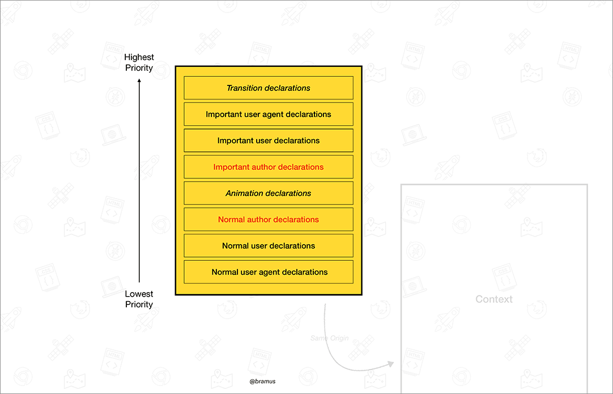

# 誤解しているかも！ CSSの詳細度について、よくある誤解を解説

[誤解しているかも！ CSSの詳細度について、よくある誤解を解説](https://coliss.com/articles/build-websites/operation/css/misconceptions-about-css-specificity.html)

## memo

- 「詳細度が 10進数ではない」というのは知ってました
  - でも意外とこういう解説してる記事を見かけるかもとも思いました
- style属性はカスケードの初期ステップで評価される
  - 確かに、HTML の属性なので言われてみればという感じ
  - けど、style属性の上書きはできないんだっけ？
  - -> できない [style](https://developer.mozilla.org/ja/docs/Web/HTML/Global_attributes/style)
  - けど、詳細度とは別の世界線のものと捉える感じ
- `!important`
  - `!important` も別の世界線っぽいイメージ
  
  - とはいえ、`!important` は使わないが吉！